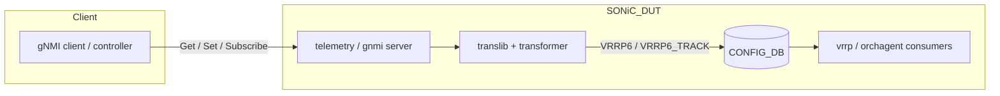
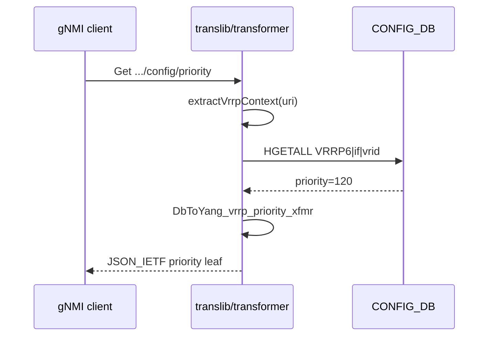
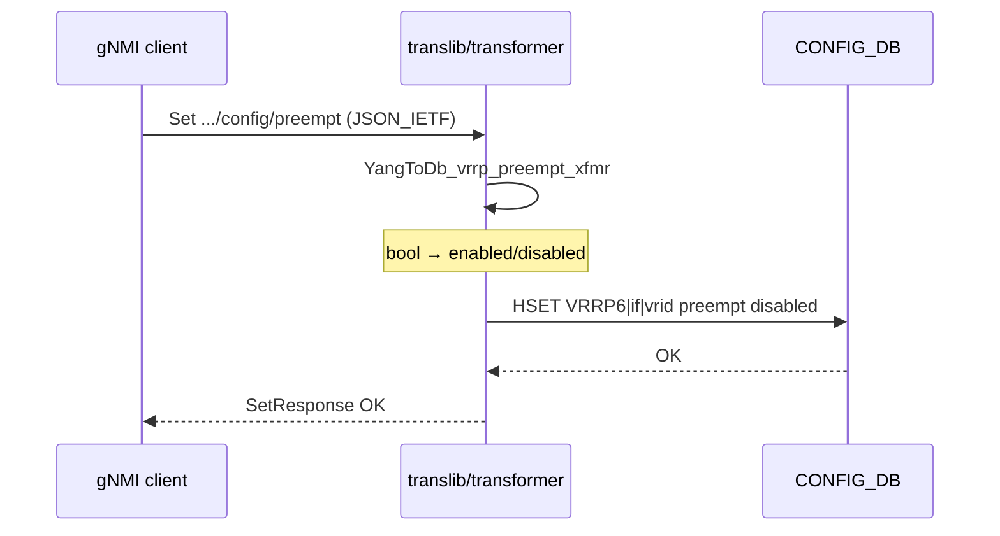

# HLD: OpenConfig IPv6 VRRP over gNMI

| Field | Value |
|-------|-------|
| **Title** | OpenConfig IPv6 VRRP gNMI transformer — High Level Design |
| **Version** | 1.2 |
| **Date** | 2026-08-14 |
| **Related implementation** | [sonic-net/sonic-mgmt-common#242](https://github.com/sonic-net/sonic-mgmt-common/pull/242) (draft) |
| **Validation target** | Strict leaf GET + Set with CONFIG_DB verify |

---

## 1. Purpose

This document describes the high-level design for exposing **OpenConfig IPv6 VRRP** configuration and operational state over **gNMI** on SONiC, using the existing **mgmt-common transformer** framework. Prior to this work, VRRP leaves often returned **parent GET only** because no transformer mapped OpenConfig paths to SONiC CONFIG_DB.

### 1.1 Goals

- Enable gNMI **Get** and **Set** (Update/Replace) for five scoped VRRP leaves under an IPv6 interface address.
- Map OpenConfig `vrrp-group` to SONiC **`VRRP6`** and **`VRRP6_TRACK`** CONFIG_DB tables.
- Follow existing transformer patterns (annotations + `xfmr_*.go` + unit tests).
- Preserve coexistence of global virtual addresses and link-local VIP in a single DB field (`vip@`).

### 1.2 Non-goals (v1)

- IPv4 VRRP over OpenConfig (remains `not-supported` in interfaces deviation).
- Full OpenConfig VRRP model (timers, accept-mode, checksum, state counters not in initial scope).
- APPL_DB / kernel / `vrrpd` implementation changes — assumes platform already consumes `VRRP6*`.
- Upstream `sonic-yang-models` schema for `VRRP6` / `VRRP6_TRACK` (tracked as follow-up PR).

---

## 2. Background

### 2.1 Problem statement

Initial gNMI testing showed:

| Observation | Root cause |
|-------------|------------|
| VRRP rows returned parent data only | Parent `address` or `subinterface` GET succeeded; **no `vrrp` subtree** in response |
| Strict leaf GET **NotFound** | No transformer bindings for VRRP paths |
| Some clients used incorrect xpath | `[vrid=N]` vs `[virtual-router-id=N]`; vrrp under subinterface instead of under `address` |

### 2.2 OpenConfig placement

Per `openconfig-if-ip.yang`, VRRP is modeled **under the IP address**, not directly under the subinterface:

```
interfaces/interface[name=<if>]
  subinterfaces/subinterface[index=0]
    ipv6/addresses/address[ip=<v6>]
      vrrp/vrrp-group[virtual-router-id=<id>]
        config/...
        state/...
        interface-tracking/...
```

List key: **`virtual-router-id`** (uint8).

---

## 3. Requirements

### 3.1 Path inventory

Base URI (gNMI path prefix):

```text
/openconfig-interfaces:interfaces/interface[name=<if>]
  /subinterfaces/subinterface[index=0]
  /ipv6/addresses/address[ip=<v6>]
  /vrrp/vrrp-group[virtual-router-id=<id>]
```

| # | Feature | Relative path | OC type | R/W |
|---|---------|---------------|---------|-----|
| 1 | Priority | `config/priority` | uint8 | R/W |
| 2 | Preempt | `config/preempt` | boolean | R/W |
| 3 | Interface tracking | `interface-tracking/config` | container | R/W |
| 3a | Tracked interfaces | `.../track-interface` | leaf-list string | R/W |
| 3b | Priority decrement | `.../priority-decrement` | uint8 | R/W |
| 4 | Virtual IPv6 address | `config/virtual-address` | leaf-list inet:ipv6-prefix | R/W |
| 5 | Virtual link-local | `config/virtual-link-local` | inet:ipv6-prefix | R/W |

Corresponding **state** leaves are readable via DbToYang field transformers on the same annotations.

### 3.2 Acceptance criteria

| Level | Criterion |
|-------|-----------|
| **Read** | Strict leaf GET returns configured value (not parent fallback) |
| **Read-write** | gNMI Set (JSON_IETF) succeeds → GET-after matches → CONFIG_DB row matches → revert OK |
| **Regression** | Unit test `Test_oc_vrrp6_group_operations` passes with `testapp` build tag |

---

## 4. Architecture overview



### 4.1 Software layers

| Layer | Artifact | Responsibility |
|-------|----------|----------------|
| YANG model | `openconfig-if-ip.yang` | Standard OC VRRP tree under IPv6 address |
| Deviation | `openconfig-interfaces-deviation.yang` | **Remove** `not-supported` on IPv6 `vrrp` |
| Annotation | `openconfig-if-ip-vrrp-annot.yang` | Bind OC paths → DB table/field/subtree xfmrs |
| Model load list | `config/transformer/models_list` | Compile annotation into transformer |
| Implementation | `translib/transformer/xfmr_vrrp.go` | YangToDb / DbToYang / Subscribe logic |
| Tests | `translib/transformer/xfmr_vrrp_test.go` | Redis mock CONFIG_DB round-trip |

---

## 5. Data model mapping

### 5.1 CONFIG_DB tables

#### Table: `VRRP6`

| Key | Fields (v1) | Description |
|-----|-------------|-------------|
| `{interface}\|{vrid}` | `vid`, `priority`, `preempt`, `vip` or `vip@` | One row per VRRP group on an L3 interface |

- **`vid`**: virtual router ID (redundant with key component; written on priority/preempt SET).
- **`preempt`**: `enabled` / `disabled` (not raw boolean strings in DB).
- **`vip@`**: comma-separated IPv6 prefixes — **global VIPs and link-local VIP share this list field**.

#### Table: `VRRP6_TRACK`

| Key | Fields (v1) | Description |
|-----|-------------|-------------|
| `{interface}\|{vrid}\|{track_if}` | `priority_increment` | Tracked interface + decrement value |

**Naming note:** OpenConfig uses `priority-decrement`; SONiC DB field is `priority_increment` (existing platform convention).

### 5.2 OpenConfig ↔ CONFIG_DB mapping

| OpenConfig leaf | Transformer | CONFIG_DB |
|-----------------|-------------|-----------|
| `config/priority` | `YangToDb_vrrp_priority_xfmr` | `VRRP6.priority` |
| `config/preempt` | `YangToDb_vrrp_preempt_xfmr` | `VRRP6.preempt` |
| `config/virtual-address` | `YangToDb_vrrp_virtual_address_xfmr` | `VRRP6.vip@` (non–link-local entries) |
| `config/virtual-link-local` | `YangToDb_vrrp_virtual_link_local_xfmr` | `VRRP6.vip@` (fe80:: entry) |
| `interface-tracking/config` | `vrrp_interface_tracking_xfmr` (subtree) | `VRRP6_TRACK` rows |

### 5.3 VIP merge semantics

Both `virtual-address` and `virtual-link-local` map to the same DB field. The transformer **merges** rather than replaces:

```text
On SET virtual-address:
  new_vip@ = global_addrs_from_OC ++ link_local_addrs_from_existing_DB

On SET virtual-link-local:
  new_vip@ = global_addrs_from_existing_DB ++ [link_local_from_OC]

On DELETE virtual-address:
  strip global addrs; retain fe80:: entries

On DELETE virtual-link-local:
  strip fe80:: entries; retain global addrs
```

Link-local detection: prefix `fe80:` (case-insensitive).

DbToYang splits `vip@` back into separate OC leaves for GET.

---

## 6. Component design

### 6.1 YANG deviation (enable tree)

**File:** `models/yang/extensions/openconfig-interfaces-deviation.yang`

Remove deviation block that marked IPv6 address VRRP as `not-supported`. IPv4 VRRP remains unsupported in SONiC OC profile.

### 6.2 Annotation module

**File:** `models/yang/annotations/openconfig-if-ip-vrrp-annot.yang`

| Deviation target | Extension | Bound function |
|------------------|-----------|----------------|
| `vrrp-group` list | `table-name`, `table-transformer`, `key-transformer` | `VRRP6`, `vrrp_table_xfmr`, `YangToDb_vrrp_group_key_xfmr` |
| `config/state priority` | `field-name`, `field-transformer` | `priority`, Yang/Db pair |
| `config/state preempt` | same pattern | `preempt` |
| `config/state virtual-address` | same | `vip`, VIP merge xfmrs |
| `config/state virtual-link-local` | same | `vip`, link-local xfmrs |
| `interface-tracking` | `subtree-transformer` | `vrrp_interface_tracking_xfmr` |
| `interface-tracking/config` | `table-name` | `VRRP6_TRACK` |

**Registration:** entry `openconfig-if-ip-vrrp-annot.yang` in `config/transformer/models_list` immediately after `openconfig-if-ip.yang`.

### 6.3 Table transformer

**Function:** `vrrp_table_xfmr`

Selects CONFIG_DB table from URI context:

- URI contains `interface-tracking` → **`VRRP6_TRACK`**
- Otherwise → **`VRRP6`**

Required because both tables hang off the same OC `vrrp-group` list but use different key shapes.

### 6.4 Key transformer

**Function:** `YangToDb_vrrp_group_key_xfmr` / `DbToYang_vrrp_group_key_xfmr`

- Yang → Db key: `{interface}|{virtual-router-id}`
- Accepts legacy path key name **`vrid`** for clients that predate OC naming.
- Subscribe wildcard: `*|*` when interface or vrid unspecified.

### 6.5 Interface tracking (subtree)

OpenConfig models tracking as a **single container** with leaf-list + decrement. SONiC models it as **one DB row per tracked interface**.

**YangToDb (subtree):** For each `track-interface` in OC config, emit:

```text
VRRP6_TRACK|{intf}|{vrid}|{track_if}  →  priority_increment: {decrement}
```

**DbToYang:** Scan all `VRRP6_TRACK` keys with prefix `{intf}|{vrid}|`, aggregate into OC `track-interface` list and shared `priority-decrement`.

Leaf-level field xfmrs for `track-interface` and `priority-decrement` are **no-ops** on YangToDb (handled entirely by subtree xfmr) but implement DbToYang for state reads.

**Subscribe:** pattern `{intf}|{vrid}|*` on `VRRP6_TRACK`.

---

## 7. Request flows

### 7.1 GET (config leaf)



### 7.2 SET (Update leaf)



**gNMI note:** SET payloads should use JSON_IETF wrapper, e.g. `{"openconfig-if-ip:preempt": false}`.

### 7.3 SET (interface-tracking container)

Client sends container at `interface-tracking/config`. Subtree transformer expands to N **`VRRP6_TRACK`** keys. Replacing tracking config should overwrite tracked rows for that group (transformer DELETE on subtree clears before apply per translib semantics).

---

## 8. Dependencies and assumptions

| Dependency | Assumption |
|------------|------------|
| L3 interface | IPv6 address `{if}\|{prefix}` exists in `INTERFACE` table before VRRP config |
| VRRPv6 stack | Platform daemon reads `VRRP6` / `VRRP6_TRACK` and programs data plane |
| CONFIG_DB schema | Target image provides `VRRP6*` schema; community builds may need a `sonic-yang-models` follow-up |
| Subinterface index | Typical deployments use `index=0`; transformer defaults missing index to `0` |
| Image rebuild | mgmt-common image includes updated `models_list` |

---

## 9. Testing strategy

### 9.1 Unit tests (mgmt-common)

**File:** `xfmr_vrrp_test.go` — build tag `testapp`

| Test case | Validates |
|-----------|-----------|
| PUT priority | `VRRP6.priority` update |
| PUT preempt false | `preempt=disabled` |
| PUT virtual-address | `vip@` global list |
| PUT virtual-link-local | merge into `vip@` with globals preserved |
| PUT interface-tracking | `VRRP6_TRACK` row + `priority_increment` |

Run:

```bash
go test -tags testapp ./translib/transformer/ -run Test_oc_vrrp6 -count=1
```

### 9.2 Live DUT validation

1. Bootstrap: assign IPv6 on a test port; create baseline `VRRP6` if required by platform CLI.
2. For each of five leaves: Get → Set → Get-after → verify CONFIG_DB → revert.
3. Re-run strict leaf GET coverage using canonical paths with `virtual-router-id`.

### 9.3 Integration tests (planned)

Add gNMI functional tests with CONFIG_DB verification for each supported leaf.

---

## 10. Deployment

1. Merge the implementation PR ([sonic-mgmt-common#242](https://github.com/sonic-net/sonic-mgmt-common/pull/242)) into buildimage `src/sonic-mgmt-common`.
2. Rebuild the container that packages translib for the target image (telemetry / mgmt-framework).
3. Deploy to a lab device with VRRPv6 support.
4. Re-run gNMI GET/SET validation for all supported VRRP leaves.

No separate config migration: new capability only.

---

## 11. Risks and mitigations

| Risk | Impact | Mitigation |
|------|--------|------------|
| Missing `VRRP6` YANG in community sonic-yang-models | CONFIG validation failures | Follow-up PR to add schema |
| Wrong xpath (`vrid`, wrong tree location) | False negatives in testing | Document canonical path; legacy `vrid` fallback in key xfmr |
| VIP merge bugs | Overwrite link-local or global VIP | Dedicated merge helpers + unit tests for ordering |
| OC leaf-list vs single link-local | Type mismatch on SET | Accept `*string` and `*[]string` in virtual-address xfmr |
| Platform ignores CONFIG_DB | gNMI passes but no dataplane effect | Out of scope for mgmt-common; verify operationally (e.g. `show vrrp`) |

---

## 12. Future work

| Item | Repo | Notes |
|------|------|-------|
| `VRRP6` / `VRRP6_TRACK` YANG schema | sonic-yang-models | Enable validation on community builds |
| IPv4 OC VRRP | sonic-mgmt-common | Separate effort; IPv4 still `not-supported` |
| Additional OC VRRP leaves | sonic-mgmt-common | accept-mode, ad-interval, checksum — if scope expands |
| gNMI integration tests | sonic-mgmt | End-to-end Set + CONFIG_DB verify |
| Subscribe / ON_CHANGE | mgmt-common | Extend beyond tracking subtree if required |

---

## 13. File manifest

| Path | Role |
|------|------|
| `translib/transformer/xfmr_vrrp.go` | Transformer implementation |
| `translib/transformer/xfmr_vrrp_test.go` | Unit tests |
| `models/yang/annotations/openconfig-if-ip-vrrp-annot.yang` | Annotations |
| `models/yang/extensions/openconfig-interfaces-deviation.yang` | Enable IPv6 VRRP |
| `config/transformer/models_list` | Load annotation model |

---

## 14. References

- OpenConfig model: `openconfig-if-ip` VRRP under `ipv6/addresses/address`
- Implementation PR: https://github.com/sonic-net/sonic-mgmt-common/pull/242

---

## Appendix A — Example gNMI paths

**Base (Ethernet64, VRID 1, address 2001:db8::1):**

```text
/openconfig-interfaces:interfaces/interface[name=Ethernet64]
/subinterfaces/subinterface[index=0]
/ipv6/addresses/address[ip=2001:db8::1]
/vrrp/vrrp-group[virtual-router-id=1]
```

**Example SET targets:**

```text
.../config/priority
.../config/preempt
.../config/virtual-address
.../config/virtual-link-local
.../interface-tracking/config
```

## Appendix B — Example CONFIG_DB after configuration

```text
127.0.0.1:6379> HGETALL "VRRP6|Ethernet64|1"
1) "priority"
2) "120"
3) "preempt"
4) "disabled"
5) "vip@"
6) "2001:db8::10/128,2001:db8::11/128,fe80::1/64"

127.0.0.1:6379> HGETALL "VRRP6_TRACK|Ethernet64|1|Ethernet72"
1) "priority_increment"
2) "20"
```
